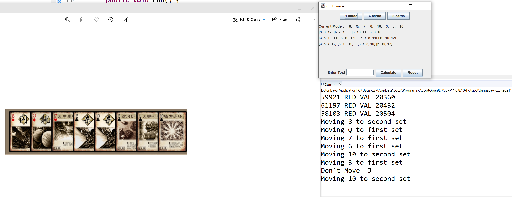

# AutomaticZhangLaoShi

This simple to use Java Swing application allows for automatic calculation and optimization of a set of cards into two piles of equal costs, which is zhang chang pu's special ability, using screen capture, OpenCV and Tesseract OCR.

The below example demonstrates hand 8, Q,7,6,10,3,J,10, so one of the most optimal way is to have 3,8,Q = 3 + 8 +12  and 6+7+10=23.

